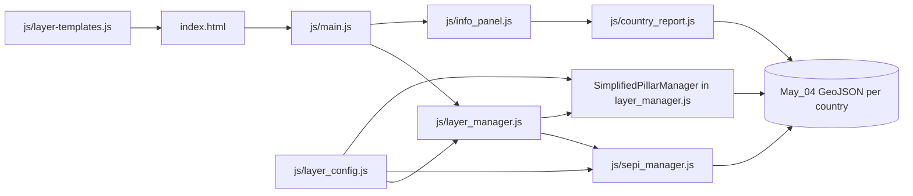

# Socioeconomic Peace Index Tool

An interactive web mapping application for exploring the **Socio-Economic Peacebuilding Index (SEPI)** and related conflict indicators across Kenya, Somalia, and South Sudan at the sub-national (Admin-1) level.

SEPI helps researchers, policymakers, and practitioners visualize structural socioeconomic conditions associated with conflict vulnerability, compare regions within a country, and connect analysis to peacebuilding and development planning—especially in fragile contexts.

---

## About SEPI

The **Socio-Economic Peacebuilding Index (SEPI)** is a composite indicator developed by the United Nations Development Programme (UNDP) **Istanbul International Centre for Private Sector in Development (ICPSD)** to measure structural socio-economic conditions linked to conflict vulnerability in the Horn of Africa.

SEPI is grounded in **relative deprivation theory**: the gap between perceived entitlements and actual conditions can create grievances that escalate into collective violence under certain socioeconomic conditions. The index is designed to support development actors, government partners, and donors in identifying where integrated peacebuilding and development investments are most urgently needed.

Scores range from **0 to 1**, where higher values reflect stronger relative structural conditions and lower vulnerability. Scores are **min–max normalized within each country** and are **not comparable across countries**.

The overall SEPI score is a **geometric mean** of five equally weighted pillars. A very low score on any single pillar substantially depresses the composite score—a region cannot compensate for severe deprivation in one dimension with high performance in another.

> **Important:** SEPI is a structural baseline, not a real-time early warning tool. Results should be read alongside contextual knowledge and other data sources.

### The five pillars

| Pillar | What it captures |
|--------|------------------|
| **Education** | School attendance, literacy, school access, teacher presence |
| **Food security** | Share of population in IPC Crisis or Worse (Phase 3+) |
| **Poverty reduction** | Poverty headcount, income/expenditure per capita |
| **Health access** | Healthcare access, health facility density, hospital density |
| **Climate resilience** | Vegetation health (NDVI), soil moisture, drought severity (PDSI), FAPAR |

---

## What this tool provides

- **Interactive choropleth maps** of the Overall Peace Index and each pillar at Admin-1 level
- **Sub-indicator drill-down** — select any indicator under a pillar to map it directly and inspect district values
- **Regional detail panels** — click a region for SEPI score, pillar breakdown, rank, and district overview
- **Conflict overlays (ACLED)** — annual fatalities and events (2016–2025), including per-100k rates; display only, **not part of SEPI computation**
- **Analysis tools** — district rankings, time-series charts, contextual summaries, and exportable country reports
- **Supplementary raster layers** — climate, accessibility, population, and other geospatial context layers by country

Supported countries: **Somalia**, **South Sudan**, and **Kenya**.

---

## How to use the map

1. **Select a country** — use the country buttons in the left panel (Somalia, South Sudan, or Kenya).
2. **Choose a layer** — select *Overall Peace Index* for the composite score, or one of the five pillar indices.
3. **Read the map** — use the legend to interpret region colours by score range (red = deprivation, green = resilience).
4. **Click a region** — open district details with SEPI score, pillar scores, and overview.
5. **Drill into sub-indicators** — select any indicator listed under a pillar to map it and inspect values.

The **Welcome** tab in the analysis panel provides a full in-app guide, including conflict data usage.

For methodology, data sources, FAQs, and indicator definitions, see **[About SEPI](html/more.html)** in the application.

---

## Getting started

This is a static web application (HTML, CSS, JavaScript modules). It must be served over HTTP—opening `index.html` directly from the filesystem will not load GeoJSON and other data correctly.

### Prerequisites

- A modern web browser
- A local HTTP server (Python, Node.js, or any static file server)

### Run locally

From the repository root:

**Python 3**

```bash
python -m http.server 8080
```

**Python 2**

```bash
python -m SimpleHTTPServer 8080
```

**Node.js (npx)**

```bash
npx serve .
```

Then open [http://localhost:8080](http://localhost:8080) in your browser.

### Deploy

Host the repository contents on any static hosting service (e.g. GitHub Pages, Netlify, or an UNDP web server). No build step is required.

---

## Project structure

High-level layout of what the **live application** loads. Files under `js/depreceated/`, `js/backup/`, and most raw CSV/XLSX in `data/` are **not** used at runtime (see [Unused files](#files-not-used-at-runtime) at the end).

```
Socioeconomic-Peace-Index-Tool/
├── index.html                    # Main map app entry point
├── all_adm1_overview.csv         # District overview text for popups (fetched at runtime)
├── descriptions_Pillar.csv       # Pillar descriptions for Active Layers panel
├── html/
│   ├── more.html                 # About SEPI — methodology, sources, FAQ
│   └── about.html                # About the tool and team
├── css/                          # Stylesheets (see below)
├── js/                           # ES module application code (see below)
├── data/
│   ├── conflict_pooled_breaks.json   # Shared ACLED colour scales (all countries)
│   ├── Kenya/                    # May_04 GeoJSON + outline
│   ├── Somalia/                  # May_04 GeoJSON, rasters, NDVI tiles, outline
│   └── South_Sudan/              # May_04 GeoJSON + outline
├── assets/                       # Logos (navbar) and About Us photos
└── scripts/                      # Python data-prep (not loaded by the browser)
```

External libraries are loaded from CDN in `index.html` (not from `js/libs/`): [Leaflet](https://leafletjs.com/), [GeoTIFF.js](https://geotiffjs.github.io/), [proj4js](https://github.com/proj4js/proj4js), [html2canvas](https://html2canvas.hertzen.com/), [jsPDF](https://github.com/parallax/jsPDF).

---

## Active files reference

### Entry points and static pages

| File | Purpose |
|------|---------|
| `index.html` | Main application shell: navbar, left layer sidebar, Leaflet map, right analysis panel slot, CDN script tags, and bootstrap of `js/main.js`. |
| `html/more.html` | Standalone **About SEPI** page — methodology flow, indicator tables, data sources, FAQ, citation. Styled with `css/more-page.css`. |
| `html/about.html` | Standalone **About Us** page — team, mission, partners. Uses shared `css/styles.css`. |

---

### Stylesheets (`css/`)

| File | Purpose |
|------|---------|
| `styles.css` | Global layout: navbar, map/sidebar flex grid, country selector, SEPI layer controls, legend, basemap UI, analysis sidebar resize handle. |
| `info_panel.css` | Right-hand **Analysis panel**: tab bar (Welcome / Active Layers / Analysis), report layout, SEPI ranking chart, conflict timeline, welcome-tab conflict guide styles, conflict-report styling. |
| `pop_styles.css` | Optional **welcome modal** overlay (`WelcomePopup`) and draggable SEPI info popup chrome. |
| `sepi_info_popup.css` | Static SEPI explainer popup (opened via ℹ on country selector). |
| `more-page.css` | Typography and tables for the About SEPI static page only. |

---

### JavaScript modules (`js/`)

The app is ES modules with **`js/main.js`** as the single entry point.

#### Bootstrap and map shell

| File | Purpose |
|------|---------|
| `main.js` | Initializes Leaflet map, country switching, outline preloading, layer control wiring, raster cleanup, syncs active layers to `InfoPanel`, keyboard shortcuts (`I` panel, `H` help popup). Loads `descriptions_Pillar.csv` for pillar blurbs. |
| `basemaps.js` | Default basemap tiles and basemap switcher options. |
| `admin_labels.js` | Map control for **ADM1 labels** and country outline dropdown; groups district GeoJSON into region labels. |
| `legend.js` | Map legend rendering for SEPI, pillars, conflict layers, and rasters. |

#### Configuration and UI templates

| File | Purpose |
|------|---------|
| `layer_config.js` | **Single source of truth** for layer IDs, URLs (`getCountryPath`), country views, pillar/sub-indicator definitions (`PILLAR_CONFIG`), colour ramps, conflict normalisation helpers, and routing of `sepi_with_pillars_9_2.geojson` → live **May_04** bundles per country. |
| `layer-templates.js` | Builds left-sidebar HTML: country dots, SEPI/pillar/sub-indicator buttons, optional vector/raster toggles, conflict year slider hooks. |

#### Layer loading and map interaction

| File | Purpose |
|------|---------|
| `layer_manager.js` | Central orchestrator: toggles vector/point/raster layers, delegates to `SEPIManager` and `SimplifiedPillarManager`, handles conflict year changes, pooled conflict colour scales, popups/tooltips. |
| `sepi_manager.js` | **Overall SEPI** choropleth: loads country GeoJSON, auto-detects composite field (`sepi`), styles regions, popups with pillar mini-bars, primary conflict-driver overlay, fetches `all_adm1_overview.csv` for district narratives. |
| `vector_layers.js` | Generic GeoJSON vector and point layer loader used for admin statistics and similar optional layers. |
| `zoom-adaptive-tiff-loader.js` | Loads GeoTIFF rasters (Somalia supplementary layers) with zoom-aware resolution. |

#### Analysis panel and reports

| File | Purpose |
|------|---------|
| `info_panel.js` | Docked right **Analysis panel** class: Welcome / Active Layers / Analysis tabs, district ranking chart, conflict timeline canvas, **Generate Report** and PDF export (`html2canvas` + `jsPDF`). |
| `country_report.js` | Builds country reports from live GeoJSON. **SEPI mode** (default): peacebuilding capacity tables + narrative. **Conflict mode** (when a conflict layer is active): Conflict Context sections, national trend charts, highest-conflict districts, plus peacebuilding tables from PDF/docx spec. |
| `country_report_narrative.js` | Static copy for SEPI country reports (main actors, strong/weak regions, resilience) — sourced from country report documents. |
| `conflict_context_content.js` | Static copy for conflict reports (profile, trends, conflict-intensive districts) — sourced from Conflict Context document. |
| `sepi_dashboard_content.js` | Country narrative blocks shown in **Active Layers** when Overall SEPI is selected (spatial patterns and explanatory factors). |
| `sepi_methodology_content.js` | HTML fragment for SEPI worked example (used in report methodology section). |

#### Optional UX helpers

| File | Purpose |
|------|---------|
| `welcome_popup.js` | First-visit modal welcome (optional; can be triggered with `H` or `window.debug.showWelcome()`). |
| `draggable_sepi_popup.js` | Makes SEPI detail popups draggable on the map. |

---

### Root-level data files (loaded at runtime)

| File | Purpose |
|------|---------|
| `descriptions_Pillar.csv` | Maps dashboard pillar names → short overview text shown in Active Layers when a pillar is selected. |
| `all_adm1_overview.csv` | Per-district `adm1_overview` paragraphs and source URLs for SEPI click popups (keyed by country + region name). |
| `data/conflict_pooled_breaks.json` | Precomputed 2nd–98th percentile colour breaks for ACLED conflict layers, pooled across Kenya, Somalia, and South Sudan. Generated by `scripts/compute_conflict_pooled_breaks.py`. |

---

### Country data (`data/{Kenya,Somalia,South_Sudan}/`)

All SEPI, pillar, sub-indicator, and conflict fields used by the map live in **one GeoJSON bundle per country**. Code requests `sepi_with_pillars_9_2.geojson`; `layer_config.js` redirects to the **May_04** files:

| Country | Live bundle | Also used |
|---------|-------------|-----------|
| **Kenya** | `sepi_with_pillars_May_04_Kenya.geojson` | `kenya_outline.geojson` (map outline) |
| **Somalia** | `sepi_with_pillars_May_04_Somalia.geojson` | `old/somalia_outline.geojson` (outline fallback), optional rasters (below) |
| **South Sudan** | `sepi_with_pillars_May_04_South_Sudan.geojson` | `south_sudan_outline.geojson` (map outline) |

Each bundle contains Admin-1 geometries plus properties for:

- Composite **`sepi`** and five **`pillar_*`** scores  
- Normalised **sub-indicators** (e.g. `school_access_pop_norm`, `rs_ndvi_norm`)  
- **ACLED conflict** yearly fields (`count_conflict_events_2016` … `_2025`, fatalities, per-100k variants)

#### Somalia supplementary rasters (optional sidebar layers)

Only **Somalia** currently ships raster assets. If the user enables them in the left panel, the app loads files such as:

| File (under `data/Somalia/`) | Layer |
|------------------------------|--------|
| `elevation.tif`, `soil_moisture.tif`, `temperature.tif`, `rainfall.tif` | Environmental context |
| `population.tif`, `roads.tif`, `education.tif`, `health.tif`, `celltower.tif` | Infrastructure / access |
| `VNP46A2_2024_Somalia.tif` | Nighttime lights |
| `NDVI_Change/Somalia_NDVI_Change_*_to_*.tif` | Year-pair vegetation change |

Kenya and South Sudan do **not** include these rasters; enabling those controls for those countries will not find local files.

---

### Assets (`assets/`)

| File | Purpose |
|------|---------|
| `pigeon2.png`, `icpsd_logo.png`, `undp_logo.png` | Navbar logos (referenced in HTML; add to repo if missing locally) |
| `johannes_Sahmland_bowling.jpg`, `szigeti.jfif`, `Martin_Szigeti.jpg`, `Paul_Vercoustre.jfif`, `ela_dogan.jfif`, `viddhi_Thrakker.jpeg` | Team photos on **About Us** |
| `*_bio.txt` | Short bios paired with team photos |

---

### How the main pieces connect



1. User picks country → `layer_config.js` sets paths and map view.  
2. User picks SEPI / pillar / sub-indicator / conflict → `layer_manager.js` loads the same GeoJSON with different property columns.  
3. Clicks and rankings → `sepi_manager.js` / panel use `all_adm1_overview.csv`.  
4. **Generate Report** → `country_report.js` reads GeoJSON + narrative modules; conflict layer active switches report layout.

#### Welcome tab vs welcome popup

Two separate UI surfaces share similar content but use different files:

| Surface | Where it appears | Files |
|---------|------------------|-------|
| **Welcome tab** | Default tab in the docked right analysis panel | `info_panel.js` (HTML in `createPanel()` / `setActiveTab()`), `info_panel.css` (`.welcome-content`, `.welcome-conflict-*`) |
| **Welcome popup** | Optional modal overlay (first visit or `H` key) | `welcome_popup.js`, `pop_styles.css` |

---

### Maintenance scripts (`scripts/`) — not loaded by the browser

| Script | Purpose |
|--------|---------|
| `compute_conflict_pooled_breaks.py` | Regenerates `data/conflict_pooled_breaks.json` from May_04 GeoJSON. |
| `merge_subindicator_master.py` | Merges sub-indicator columns into country GeoJSON from master spreadsheet. |
| `scale_conflict_per_100k.py` | Computes per-100k conflict fields for GeoJSON updates. |

---

### Files not used at runtime

The following are kept for history, authoring, or local development but **are not imported or fetched** by the live tool:

- `js/depreceated/` — replaced integration modules  
- `js/backup/` — old main/tiff loader experiments  
- `js/libs/proj4js-2.15.0/` — vendored proj4 (app uses CDN instead)  
- Superseded GeoJSON (`Apr_28`, `sepi_with_pillars_9_2`, `old/`, etc.)  
- Raw CSV/XLSX/ACLED exports and dashboard `.docx` under `data/` and `Final_Files_For_Analysis/` (content is embedded in JS modules)  
- Root `conflicts.geojson`, `conflicts.qmd`, `Untitled.png`

If you trim the repo for deployment, keep everything listed in [Active files reference](#active-files-reference) above.

---

## Data sources

| Category | Source | Coverage |
|----------|--------|----------|
| Food security | IPC / HDX HAPI | 2024–2025 |
| Education | National censuses and surveys (Kenya, Somalia, South Sudan) | 2019–2022 |
| Health access | Government of Kenya; WHO health facility database | 2024–2025 |
| Poverty reduction | OPHI; national statistics bureaus; CLiMIS South Sudan | 2022–2024 |
| Accessibility | Heidelberg Institute for Geoinformation Technology | 2025–2026 |
| Climate / environment | Google Earth Engine Data Catalog | 2023–2024 |
| Administrative boundaries | UN OCHA COD | Current official releases |
| Conflict (display only) | [ACLED](https://acleddata.com/) | 2016–2025 |

Conflict data covers Battles, Explosions/Remote Violence, and Violence against Civilians. It is used for validation and contextual visualization, not in SEPI score calculation.

Full source tables and country-specific indicator lists are in **[About SEPI](html/more.html)**.

---

## Development and partners

The Socioeconomic Peace Index Tool was developed by the **UNDP ICPSD Crisis & Resilience Team** in collaboration with the **UNDP SDG AI Lab**, with support from **UNDP Regional Bureau for Africa (RBA)** and in-country partners including national statistical offices.

Partners and contributing units include:

- United Nations Development Programme (UNDP)
- Istanbul International Centre for Private Sector in Development (ICPSD)
- Sustainable Development Goals AI Lab (SDG AI Lab)
- UNDP Regional Bureau for Africa (RBA)
- Bureau for Programme and Policy Support (BPPS)
- National statistical offices and in-country data partners

Learn more about the team and mission on the **[About Us](html/about.html)** page.

---

## Related repositories

- **Methodology and index construction:** [github.com/crisis-resilience/sepi](https://github.com/crisis-resilience/sepi)
- **This repository:** interactive map, dashboards, and visualization code

---

## How to cite

> UNDP ICPSD Crisis Resilience Team. (2025). *Socio-Economic Peacebuilding Index (SEPI)*. Admin-1 level composite indicator for Kenya, Somalia, and South Sudan. United Nations Development Programme. Available at: https://github.com/m-szigeti/Socioeconomic-Peace-Index-Tool

---

## Contact

Questions about the tool, methodology, or data sources:

**[johannes.sahmland.bowling@undp.org](mailto:johannes.sahmland.bowling@undp.org)**

---

## License

Unless otherwise noted, content in this repository is provided by UNDP for public use in research and programming. Third-party libraries are loaded from CDN; a legacy vendored copy of proj4js under `js/libs/` is not used by the running application.
